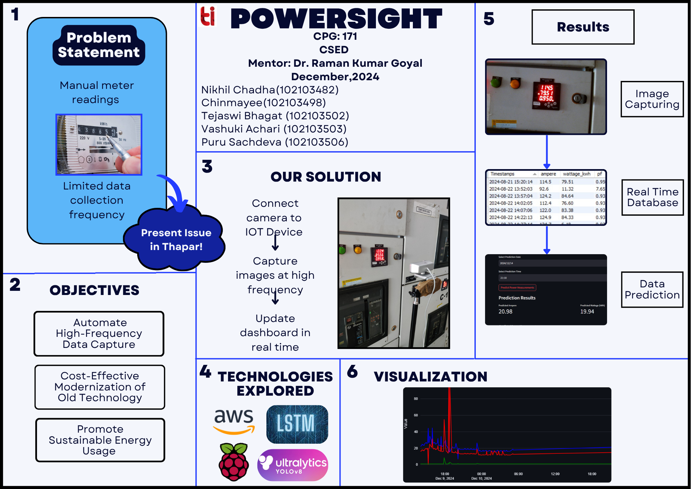

# ⚡ Powersight – Smart Meter Reading System

## 📌 Overview

Powersight is an end-to-end IoT and Computer Vision-based system designed to automate electricity meter readings. It eliminates manual data collection by capturing images of meters, extracting readings using AI, and visualizing the data through an interactive dashboard.

---

## 🖼️ Project Poster

---

## 🚀 Features

* 📸 Automated image capture using Raspberry Pi
* 🤖 Meter detection using YOLO object detection
* 🔍 OCR-based reading extraction using Google Vision API
* ☁️ Cloud-based processing using AWS
* 🗄️ Structured storage of readings in SQL database
* 📊 Interactive dashboard built with Streamlit
* ⏱️ Fully automated pipeline using cron jobs

---

## 🏗️ System Architecture

1. **Image Capture**

   * Raspberry Pi captures meter images at regular intervals

2. **Data Transfer**

   * Images are securely transferred to AWS server via SSH/SFTP

3. **Processing Pipeline**

   * YOLO model detects and crops meter region
   * Google Vision API extracts numeric readings

4. **Data Storage**

   * Extracted readings stored in SQL database

5. **Visualization**

   * Streamlit dashboard displays usage trends and insights

---

## 🛠️ Tech Stack

* **Hardware:** Raspberry Pi, Camera Module
* **Languages:** Python
* **Computer Vision:** YOLO
* **OCR:** Google Cloud Vision API
* **Cloud:** AWS EC2
* **Database:** SQL
* **Visualization:** Streamlit
* **Automation:** Cron Jobs

---

## 📊 Sample Use Case

* Monitor electricity usage remotely
* Detect abnormal consumption patterns
* Automate billing data collection

---

## 🔥 Future Improvements

* ✅ Real-time processing using event-driven pipelines
* 📈 Advanced analytics (daily/monthly insights)
* 🚨 Alert system for abnormal readings
* 🧠 Improved OCR accuracy with custom models

---

## Note

**This repository does not contain the all the sources required to completely recreate the system**
